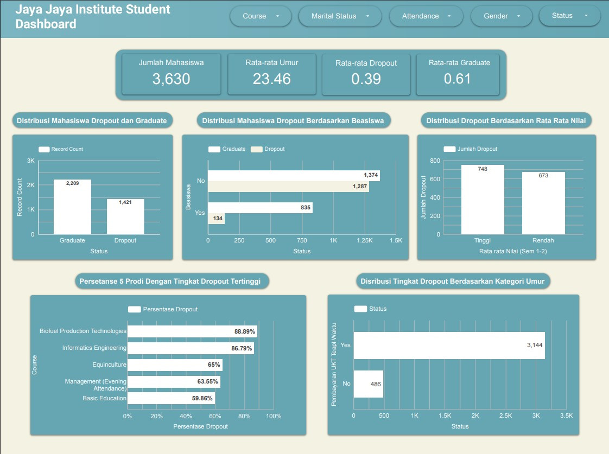

## Proyek Akhir: Menyelesaikan Permasalahan Jaya Jaya Maju Institute

### Business Understanding
**Jaya Jaya Institut**, sebagai institusi pendidikan tinggi yang telah beroperasi sejak tahun 2000, saat ini menghadapi tantangan yang cukup serius terkait tingginya angka mahasiswa yang mengalami dropout atau putus studi sebelum menyelesaikan program akademik mereka. Permasalahan ini tidak hanya mengancam kredibilitas dan reputasi institusi, tetapi juga berdampak signifikan terhadap masa depan mahasiswa itu sendiri. Mengingat pentingnya keberhasilan akademik bagi perkembangan individu dan keberlanjutan institusi secara keseluruhan, pihak manajemen membutuhkan pendekatan proaktif dan berbasis data untuk mengantisipasi risiko dropout sedini mungkin, sehingga dapat memberikan dukungan dan bimbingan yang tepat untuk mengurangi prevalensi dropout mahasiswa.


### Permasalahan Bisnis
* Tingginya prevalensi dropout mahasiswa.
* Tidak ada platform monitoring yang komprehensif untuk mendeteksi potensi mahasiswa yang berisiko dropout secara dini serta mengidentifikasi tren prevalensi dropout.
* Tidak ada sistem prediktif untuk melakukan prediksi status mahasiswa berdasarkan data akademik serta informasi pribadi mahasiswa seperti, status pernikahan, umur, finansial dan sebagainya.


### Cakupan Proyek
* Melakukan analisis serta mengidentifikasi faktor utama yang menjadi penyebab dropout.
* Membangun sebuah sistem prediktif dengan memanfaatkan Machine Learning untuk memprediksi risiko dropout berdasarkan beberapa faktor yang memiliki korelasi paling tinggi dengan target.
* Menyusun dahsboard interaktif untuk monitoring tren berdasarkan data historis mahasiswa.

**Persiapan Sumber data**: 
* [Dicoding GitHub Dataset](https://github.com/dicodingacademy/dicoding_dataset/tree/main/students_performance) 
* [UCI Machine Learning - Predict Students Dropout and Academic Success](https://doi.org/10.24432/C5MC89)

Setup environment: 
```
# Membuat virtual environment
python -m venv venv

# Mengaktifkan virtual environment
venv\Scripts\activate

# Menginstall depedensi yang dibutuhkan
pip install -r requirements.txt

# Menjalankan model prediksi
streamlit run app.py         
```
---
### Business Dashboard
Dashboard analisis dropout mahasiswa yang dikembangkan dengan menggunakan **Looker Studio** merupakan sebuah sistem visualisasi data terintegrasi yang dirancang khusus untuk monitoring dan menganalisis kondisi akademik mahasiswa di Jaya Jaya Institute. Dashboard ini berfokus pada identifikasi faktor-faktor yang mempengaruhi tingkat dropout mahasiswa dan menyediakan insight mendalam untuk mendukung pengambilan keputusan strategis dalam pengelolaan akademik.

Tujuan utama dashboard ini adalah memberikan visibilitas menyeluruh terhadap profil mahasiswa, pola dropout, dan faktor-faktor yang berkontribusi terhadap keberhasilan atau kegagalan akademik mahasiswa.

1. **Overview Institusi (Key Metrics)**
    Dashboard menampilkan 4 metrik utama yang memberikan gambaran menyeluruh kondisi institusi:
    * **Jumlah Mahasiswa**: 3,630 mahasiswa aktif
    *  **Rata-rata Umur**: 23.46 tahun
    * **Rata-rata Dropout**: 0.39 (39% tingkat dropout)
    * **Rata-rata Graduate**: 0.61 (61% tingkat kelulusan)

2. **Analisis Status Mahasiswa**
   **Distribusi Mahasiswa Dropout dan Graduate** menunjukkan perbandingan antara mahasiswa yang lulus (2,209 mahasiswa) dengan yang dropout (1,421 mahasiswa), memberikan baseline untuk evaluasi keberhasilan institusi.

3. **Analisis Faktor Finansial**
    **Distribusi Mahasiswa Dropout Berdasarkan Beasiswa** menganalisis korelasi antara status penerimaan beasiswa dengan tingkat dropout:

    * Mahasiswa tanpa beasiswa: 1,374 graduate vs 1,287 dropout
    * Mahasiswa dengan beasiswa: 835 graduate vs 134 dropout

4. **Analisis Akademik**
    **Persentase 5 Prodi Dengan Tingkat Dropout Tertinggi** mengidentifikasi program studi yang memerlukan perhatian khusus:    

    * Biofuel Production Technologies: 88.89%
    * Informatics Engineering: 86.79%
    * Equinaculture: 65%
    * Management (Evening Attendance): 63.55%
    * Basic Education: 59.86%

5. **Analisis Demografis**
   * **Distribusi Dropout Berdasarkan Rata-rata Nilai**: Membandingkan mahasiswa dengan nilai tinggi (748 dropout) vs rendah (673 dropout)
   * **Distribusi Tingkat Dropout Berdasarkan Kategori Umur**: Menunjukkan bahwa mahasiswa dengan kategori umur "Yes" memiliki 3,144 status aktif dibanding 466 dengan kategori "No"

Link Dashbord: [Student Status Analysis Dashboard](https://lookerstudio.google.com/reporting/dbae61fc-6a2e-48fb-a4bd-b5f44fb0a5c3)



### Fungsi-Fungsi Utama Dashboard:

1. **Sistem Filter Terintegrasi (Global Control)**

    Fitur kontrol ini memungkinkan pengguna untuk melakukan penyaringan data berdasarkan berbagai parameter kunci seperti **Course** (program studi), **Marital Status** (status pernikahan), **Attendance** (kehadiran), **Gender** (jenis kelamin), dan **Status** akademik mahasiswa. Fungsi ini memberikan fleksibilitas kepada **staf akademik** dan **manajemen** untuk melakukan analisis mendalam terhadap segmen mahasiswa tertentu, membandingkan performa antar kelompok, serta mengidentifikasi pola-pola spesifik yang terjadi dalam setiap kategori mahasiswa secara real-time di seluruh komponen dashboard.

2. **Dashboard Metrik Utama (Key Performance Indicators)**

    Komponen ini berfungsi sebagai pusat informasi yang menampilkan indikator performa kunci institusi, meliputi:

   - **Jumlah Total Mahasiswa**: **3,630** mahasiswa aktif
   - **Rata-rata Umur Mahasiswa**: **23.46** tahun  
   - **Tingkat Dropout**: **0.39** (39% mahasiswa mengalami dropout)
   - **Tingkat Kelulusan**: **0.61** (61% mahasiswa berhasil lulus)

    Metrik-metrik ini memberikan gambaran komprehensif mengenai kondisi akademik institusi secara keseluruhan dan menjadi acuan utama untuk evaluasi performa institusi.

3. **Analisis Faktor Determinan Dropout (Critical Factor Analysis)**

    Dashboard ini menyajikan visualisasi mendalam mengenai faktor-faktor krusial yang mempengaruhi tingkat dropout mahasiswa, antara lain:

    - **Dampak Program Beasiswa**: Menunjukkan korelasi signifikan antara penerimaan beasiswa dengan tingkat keberhasilan akademik
    - **Analisis Program Studi**: Mengidentifikasi 5 program studi dengan tingkat dropout tertinggi (Biofuel Production Technologies 88.89%, Informatics Engineering 86.79%, dan lain-lain)
    - **Pengaruh Faktor Demografis**: Menganalisis hubungan antara kategori umur dan status akademik mahasiswa
    - **Korelasi Nilai Akademik**: Mengevaluasi hubungan antara rata-rata nilai penerimaan dengan tingkat dropout

    Analisis ini membantu manajemen memahami akar permasalahan dropout dan mengidentifikasi mahasiswa dalam kategori berisiko tinggi.

4. **Visualisasi Distribusi Komprehensif (Distribution Analysis)**

    Fitur ini menampilkan komposisi dan sebaran proporsional mahasiswa berdasarkan berbagai dimensi kritis:

    - **Distribusi Status Akademik**: Perbandingan antara mahasiswa yang berhasil lulus (2,209) dengan yang dropout (1,421)
    - **Segmentasi Berdasarkan Beasiswa**: Distribusi mahasiswa graduate vs dropout pada kelompok penerima beasiswa dan non-beasiswa  
    - **Klasifikasi Berdasarkan Nilai**: Perbandingan tingkat dropout antara mahasiswa dengan nilai tinggi vs rendah
    - **Kategorisasi Umur**: Analisis distribusi mahasiswa berdasarkan kelompok umur dan status akademiknya

    Visualisasi distribusi ini memungkinkan manajemen untuk melihat kontribusi relatif setiap segmen terhadap angka dropout keseluruhan, mengidentifikasi tren demografis mahasiswa yang memerlukan perhatian khusus, serta merancang strategi intervensi yang tepat sasaran untuk setiap kelompok mahasiswa yang berbeda.

### Menjalankan Prototype Sistem Prediksi

Sistem prediksi status mahasiswa dirancang menggunakan algoritma **Random Forest** dengan tingkat akurasi sebesar **90,72%** berdasarkan hasil evaluasi. Prototype sistem prediksi memiliki fungsi utama untuk melakukan prediksi status mahasiswa berdasarkan data demografis mahasiswa seperti informasi personal, informasi akademik serta informasi finansial dengan kemungkinan **dropout** atau **graduate**. Berikut ini merupakan link untuk mengakses sistem prediksi melalui **streamlit** atau **secara lokal**.

**Link Prototype:**
[Student Predictions System Streamlit App](https://dashboard-prediction-students-performance-dataset.streamlit.app/)

**Menjalankan Prototype Secara Lokal:**
```bash
streamlit run app.py
```
---
### Conclusion
**Pencapaian Utama**:

1. **Model Prediksi Akurat**, 
Proyek ini menggunakan model machine learning **Random Forest**, dengan hasil akurasi tertinggi yang diperoleh oleh model **Random Forest** dengan akurasi sebesar **90,72%** dalam memprediksi status mahasiswa, memungkinkan deteksi dini mahasiswa berisiko dropout dengan tingkat kepercayaan tinggi.

2. **Faktor-Faktor yang Mempengaruhi Prevalensi Dropout**
Berikut faktor-faktor utama yang mempengaruhi **dropout** berdasarkan hasil **Feature Importance** model Random Forest: **status pembayaran UKT**, **status penerima beasiswa**, **nilai kualifikasi**, **kelompok umur**, **program studi**, **nilai semester (1,2)**, **mata kuliah tidak lulus** dan **mata kuliah yang lulus**. Temuan ini memberikan wawasan strategis untuk intervensi yang tepat sasaran

3. **Sistem Prediksi dan Dashboard Monitoring**
Model machine learning yang dikembangkan pada sistem prediksi menunjukkan performa yang baik dalam memprediksi status mahasiswa serta dashboard interaktif yang menyajikan visualisasi real-time untuk mempermudah dalam melakukan monitoring.

### Rekomendasi Action Items
1. **Ekspansi Program Beasiswa dan Dukungan Finansial**
   
    Tingkatkan alokasi beasiswa dan implementasikan sistem pembayaran UKT yang fleksibel, mengingat mahasiswa berbeasiswa memiliki tingkat dropout hanya 13.8% dibanding 48.4% untuk non-beasiswa. Buat program bantuan finansial darurat untuk mahasiswa dengan kesulitan ekonomi mendadak.

2. **Intervensi Khusus Program Studi Berisiko Tinggi**

    Fokus perbaikan pada program studi dengan dropout rate tertinggi: Biofuel Production Technologies (88.89%) dan Informatics Engineering (86.79%) melalui revisi kurikulum, program mentoring intensif, dan penambahan fasilitas lab atau praktikum yang memadai.

3. **Program Dukungan Akademik Terintegrasi**
    
    Implementasikan program remedial untuk mahasiswa dengan nilai rendah, study skills workshop untuk semester awal, dan academic coaching one-on-one. Sediakan peer learning groups dan layanan konseling akademik yang mudah diakses.
